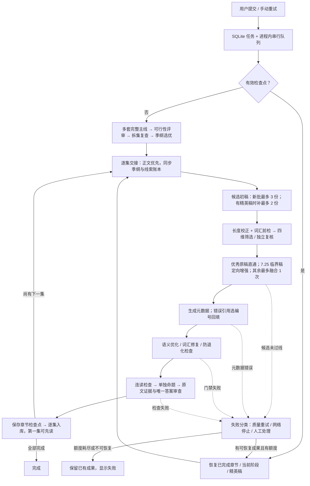

# 拾词 Read & Remember

帮助用户通过考试阅读训练提升英语词汇量的跨平台应用，支持 Web、iOS 和 Android。本仓库按客户端和服务端分离：

```text
read-remember/
├── client/   # Expo + React Native 跨平台客户端
└── server/   # Express + SQLite REST API
```

## 启动服务端

```bash
cd server
npm install
npm run setup:ecdict
npm run dev
```

默认监听 `http://0.0.0.0:4000`，详细接口见 [server/README.md](./server/README.md)。

单词释义、音标和词性由服务端 ECDICT SQLite 本地查询，不依赖在线翻译服务。词库体积较大，不提交到 Git；首次运行 `npm run setup:ecdict` 即可初始化。

服务端还提供 `npm run translate:articles` 批量翻译脚本，支持自定义 OpenAI 兼容模型、本地或云端 Base URL、模型名称、请求路径与请求头，并通过段落哈希去重和断点续跑减少 Token 消耗。生成译文后，用户可在阅读页通过“中文译文”标签查看按原文段落排列的整篇翻译。配置及使用方式见服务端 README。

文章页已支持 Kokoro 整篇朗读。首次播放按文章和音色生成音频，服务端把缓存元数据写入 SQLite、音频写入 `server/data/article-audio/`；再次播放直接命中缓存，客户端可在不重复生成音频的情况下切换 0.8x、1x、1.2x。启动 Kokoro-FastAPI 并配置 `KOKORO_BASE_URL` 后即可启用，具体配置见 [server/README.md](./server/README.md#kokoro-整篇朗读与音频缓存)。

运营后台启动后访问 `http://localhost:4000/admin/`，本地默认密钥为 `dev-admin-change-me`。后台包含运营总览、题库管理、授权内容同步、手动推送和用户运营数据。

## 启动客户端

另开一个终端：

```bash
cd client
npm install
npm start
```

客户端在 Expo Go 中会自动连接 Metro 所在电脑的 `4000` 端口。正式环境可以通过 `client/.env` 中的 `EXPO_PUBLIC_API_URL` 指定 API 地址。详细说明见 [client/README.md](./client/README.md)。

手机调试时可固定 `8081` 端口启动 Expo，并生成 Expo Go 可扫描的局域网二维码：

```bash
cd client
npm run start:qr
```

二维码同时显示在终端并保存到 `client/.expo/expo-go-qr.png`。如果 Expo 已经启动，运行 `npm run qr:expo` 即可单独重新生成；脚本支持 `--host`、`--port`、`--url` 和 `--output` 参数，详见 [客户端 README](./client/README.md#expo-go-二维码)。

客户端已配置 Android APK/AAB、iOS Simulator 及 TestFlight/App Store 构建。进入 `client/` 后可运行 `npm run build:android:apk`、`npm run build:ios:simulator` 或 `npm run build:all`，完整说明见客户端 README。

## 构建并发布 Web 网站

网站与移动端复用同一套界面和业务代码。执行：

```bash
cd server
npm run build:site
npm start
```

浏览器访问 `http://localhost:4000/` 即为用户网站，`http://localhost:4000/admin/` 仍为运营后台，API 位于 `/api/v1`。Web 产物生成在 `client/dist/`，也可部署到其他静态托管平台；若前后端不同域，构建时需将 `EXPO_PUBLIC_API_URL` 设置为公网 HTTPS API 地址。

项目根目录还提供 `Dockerfile`，可部署到任意支持 Docker 和持久磁盘的云平台。生产环境应将 `/app/data` 挂载为持久卷，并设置安全的 `ADMIN_API_KEY`。

## 故事生成阶段

以下为 **2026-09-10 当前工作区代码**的流程，不是目标设计。详细分支、检查点缺口、模型预算和优化路线见 [服务端流程审计](./server/README.md#故事生成流程与优化审计2026-09-10)。可打开 [Archify 交互概览](./docs/story-generation/current.html)，源图为 [workflow JSON](./docs/story-generation/current.workflow.json)。



说明：

- 上图压缩了模型请求内部的网络、空文本、JSON 结构恢复，以及初稿定长校正；这些局部尝试会累加，不能把“自动重试 3 次”理解为最多调用 3 次模型。
- 若检查点包含本集 `activeEpisode`，会从其修稿/评审阶段恢复，跳过重新生成候选；图中的交接→候选路径是新集或尚无该阶段成果的路径。
- 质量自动重试额度按集计算：初次运行之外最多 3 次；相同检查点重复失败可提前熔断。基础设施故障耗尽局部恢复后通常需手动重试。
- 发布语义门槛为四维均 ≥7、均分 ≥7.5；后续集还有相对第一集的降分限制。7.25 临界稿只能进入优化，不能直接发布。词汇目标 95%，实际发布底线为 `min(目标, 90%)` 并允许约 1 个词的统计容差；仍需正文、证据、连续性和题目检查。
- 当前初稿、规划蓝图与重写主要使用直接输出模式。配置的 `episodeCandidates=5` 受代码中的 3/2 上限限制，并非每批真的生成五稿。
- 已发布正文不自动重写；但选定正文尚未补完元数据时存在阶段持久化缺口，不能保证所有失败都从最后一次模型调用继续。具体修复建议见下方审计文档。
- 此次更新仅梳理代码、图示和建议，未实施优化路线，也未重新生成文章。

## 完整校验

```bash
cd client
npm run typecheck
npx expo-doctor

cd ../server
npm run typecheck
npm test
npm run build
```
