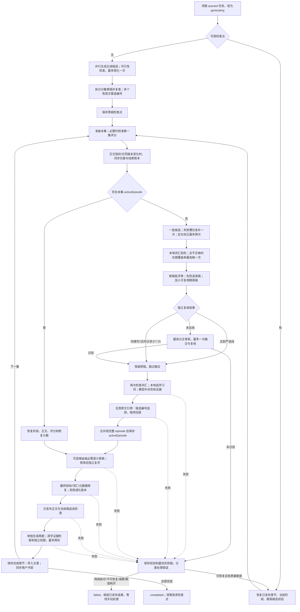
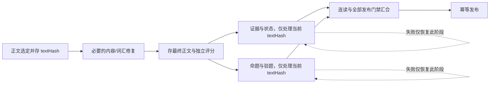

# Read & Remember API

移动端“拾词”应用对应的 TypeScript REST API。服务使用 Express 5 和 Node 内置 SQLite，默认监听 `0.0.0.0:4000`。

## 感官与混合缺陷修复（2026-09-11）

本次已实施下列修复，优先于下方 09-10 审计中的旧行为描述；完整阶段持久化等其他优化建议仍未实施。

- 感官引用必须真实出现在正文，但不再因未命中固定关键词表而阻断发布。关键词只作提示；独立语义评审和连读审查负责核对至少两种服务剧情的感官描写，连读可返回 `insufficient_sensory`。不能把“引用在原文里”等同于“感官要求成立”。
- `repair-routing.ts` 统一修复顺序：正文结构缺陷→词汇不足→元数据缺陷。词汇和元数据同时有问题时先保守换词，再根据新正文重建证据，不在未修改正文上反复生成附属数据。
- 检查点新增 `localRepairAttempts: {metadata, lexical}`，两类各一次，在网络调用前保存；这两类操作不再增加 `fullRewriteCount`。局部额度耗尽即停止同稿分支，不通过清零计数续跑。完整重写仍受原有上限控制。
- 老检查点没有独立计数时，保留旧全文计数，允许一次新机制下的局部修复；已明确 `lexicalRepairExhausted` 的旧稿不重新获得换词额度。已发布正文不修改。
- 对真实失败检查点只读复核：276 词、88.0% 覆盖率，原感官关键词误报消失；新调度正确选择词汇修复，旧全文计数 4 不再阻止尚未使用的局部额度。它仍未达到词汇发布底线，不会直接上架。

此修复不保证模型语义判断永不出错；已验证确定性路由、预算、恢复及原文引用校验，完整故事需另行重试验证。

## 故事生成流程与优化审计（2026-09-10）

本文以当前工作区代码和本地 `custom_story_logs` 为依据，日志截止 ID **2544**（2026-09-10 11:25:46 UTC，即北京时间 19:25:46）。当前工作区含尚未提交的修复；下列“现状”不是历史版本或生产环境保证。“建议”均未在本次文档任务中实施。旧的日期记录保留作变更历史；如有冲突，以本节核对的代码行为为准。

[根 README 主流程图](../README.md#故事生成阶段) · [Archify 交互概览](../docs/story-generation/current.html) · [可维护图源](../docs/story-generation/current.workflow.json)

### 1. 当前执行路径



图中展示主要分支；主线生成和模型调用等阶段也可能失败，经同一个任务级处理器分类。临界稿进入 `SELECT` 仅表示有编辑底稿，**不是通过发布门禁**。恢复 `activeEpisode` 时跳过重新选稿；交接升级可能清掉依赖旧合同的未发布稿件，不能笼统承诺所有阶段都可原位恢复。

### 2. 代码地图与存储边界

| 层次 | 代码入口 | 当前职责与落盘点 |
| --- | --- | --- |
| 队列与任务状态 | [custom-story.ts](./src/custom-story.ts)：`CustomStoryService.generate/enqueue` | SQLite 领取任务；进程内 Promise 串行队列；保存进度、日志、重试计数；启动恢复 queued/generating 任务 |
| 季纲 | [pipeline.ts](./scripts/story-generation/pipeline.ts)：`generatePlan`、`approveNarrativeSpine` | 完整主线→可行性→拆集→拆集复查→选编号；完整 plan 才进入主检查点 |
| 策划失败经验 | [plan-feasibility.ts](./scripts/story-generation/plan-feasibility.ts) | `custom_story_planning_history` 按请求独立保存最多 6 份候选评审，下一批只带阻断依据 |
| 交接与合同 | `runStoryGeneration`、`buildEpisodeWritingContract`；[serial-narrative.ts](./scripts/story-generation/serial-narrative.ts) | 以正文指纹与 `prose-ledger-v1` 判断是否同步；4 项硬任务、最多 2 个核心线索动作；已回收线索保留，ID 与章节安排禁止改变 |
| 候选与融合 | `generateEpisodeDraft`、`synthesizeEpisodeDrafts` | 前检→批评审→独立复核→优秀直通/临界增强/一次融合；部分失败稿作为 `rejectedElite` 保存 |
| 元数据 | `completeEpisodeMetadata`；[evidence-selection.ts](./scripts/story-generation/evidence-selection.ts) | 程序选学习词；模型补摘要、状态、质量证据；无效引用再选原文编号；**不是全部元数据都已改成编号生成** |
| 修稿和评审 | `reviewEpisodeSemantics`、`repairEpisode`、`materializeReviewedNarrative` | 语义重写→独立复评；正文变更后重新生成元数据；`activeEpisode` 保存阶段、评分和消耗计数 |
| 连读和题目 | `groundedSerialAuditSchema`、`groundQuestions`、`reviewGroundedQuestions` | 原文接缝、因果及终局检查；两道题的证据、选项与唯一解审核 |
| 发布 | `importStoryEpisode`、`publishEpisode` | 每集完成先存检查点，再导入文章并更新可见书架；第一集无需等待后面章节 |
| 模型传输与结构 | [model-client.ts](./scripts/story-generation/model-client.ts)、[model-response.ts](./scripts/story-generation/model-response.ts) | 流式文本提取、HTTP/超时、空输出恢复、JSON 修复/归一化、Schema 校验与局部字段修复 |
| 通用政策 | [generation-policy.ts](./scripts/story-generation/generation-policy.ts)、[attempt-policy.ts](./scripts/story-generation/attempt-policy.ts) | 分数线、候选上限、自动重试与正文 Token 预算 |

**持久化缺口（已确认）**：`generateEpisodeDraft` 选出正文之后，先调用 `completeEpisodeMetadata`，成功返回后才由外层保存 `activeEpisode`。因此“正文已选定，但元数据首次失败”未必有该正文的独立成功快照；某些 `rejectedElite` 可能可复用，但不能替代一个明确的 `selectedNarrative` 阶段。`materializeReviewedNarrative` 也存在正文优化与元数据成功耦合。上次 300 字符引用错误说明这个边界会影响恢复体验。

### 3. 实际预算、模型与门禁

本机通过配置加载器读取的允许公开字段：生成、评审、结构纠错模型均为 **MiniMax-M3**；普通请求 120 秒，重写类 480 秒；基础温度 0.65，独立评审 0.15。该快照不包含密钥或端点，配置或环境变更后应重新核对。

| 环节 | 当前实际行为 | 容易误解的地方 |
| --- | --- | --- |
| 季纲候选 | 当前配置 3 套并行；每套通常经历主线生成、评审、拆集、复查 | 不只是 3 次模型请求；每套主线失败还有一次简化及复查 |
| 正文候选 | `min(episodeCandidates, 3)`；有合格精英底稿时最多补 2 份 | 配置/CLI 默认 5，但执行策略限 3/2；词汇淘汰后可能只剩 1 份 |
| 每次队列尝试 | 1 批新候选、最多 1 次融合；失败候选槽位另补一次 | 不是“整集最多生成一次”；有独立的局部恢复层 |
| 初稿输出 | `creativeDraftModelPolicy` 关闭思考，温度 `min(配置, 0.5)` | 正文上限动态换算 Token；不是固定 8192 或 16384 |
| 规划蓝图/重写 | 当前 `semanticPlanningModelPolicy` 与 `semanticRewriteModelPolicy` 均 `disableThinking:true` | 日志“思考规划 + 直接执行”只是旧名称；目前实际为直接输出蓝图→直接输出正文 |
| 候选评分 | 批评审温度最多 0.1，失败退逐稿独立评分；最终独立复核通常 0.15 | 批筛分和独立复核不保证相同，不应把两者分差直接当正文退化 |
| 语义发布 | 四维各 ≥7、均分 ≥7.5；后续集单维较首集最多降 1、均分最多降 0.5 | 四维全 ≥7 且均分 ≥7.25 仅可进入定向增强，不得直接发布 |
| 可选增益 | 合格稿均分 <8 且有可执行改进时尝试；改后必须仍合格且更好 | 未达到采用条件回退旧稿，但调用异常仍可能使整项任务失败 |
| 正文修复 | 语义阶段 `fullRewriteCount < 2`；最终修复共用计数，上限 `<4` | 当前元数据重建也可能增加此计数，不等同于真的重写了 4 次正文 |
| 词汇 | 目标 95%；发布底线 `min(目标,0.9)`，约 1 词容差；入门两档不整体豁免高中词表 | 错误文本常显示 95%，不能据此判断真正差多少词才能发布 |
| 命题 | 正文之后独立两题，最多两轮命题及验题 | 题目失败不必重写正文，但没有完整的题目专属阶段状态机 |
| 任务级质量恢复 | 初次运行 + 每集最多 3 次自动重试；新一集重新计算 | 同一检查点同错两次可提前熔断；手动重试可重新启动，不是无限自动循环 |

模型内部的 `networkRetries`、`structureRetries` 实际是**总尝试次数**（循环从 1 开始），并非额外重试次数。`callStructured` 的每个结构尝试还可能包含首次调用加 2 次空文本恢复。以结构次数 2、网络次数 2 为例，仅该层理论上可到 `2 × (2 + 1 + 1) = 8` 次 HTTP 尝试；局部字段恢复、候选补跑和内容校正另计。这是代码路径上界示例，不代表每次都发生，也不是整任务统一上界。**480 秒是单请求预算，不是整集总时长上限。**

### 4. 最近两天日志反映的问题

以下按日志中 UTC 日期分组，统计截至 ID 2544 的消息出现次数。不是唯一任务数、不是 HTTP 请求数、不是失败率；同一篇反复修复会产生多条记录。

| UTC 日期 | 日志条数 | 质量自动续跑 | 手动启动 | 定长校正消息 | 词汇前检淘汰消息 | 结构恢复消息 | 网络失败消息 |
| --- | ---: | ---: | ---: | ---: | ---: | ---: | ---: |
| 2026-09-09 | 451 | 16 | 5 | 56 | 42 | 12 | 20 |
| 2026-09-10 | 450 | 16 | 8 | 56 | 22 | 12 | 3 |

关键证据与结论：

- **ID 2393–2479**：一次手动启动后第 2 集跑初次加 3 次自动续跑，四轮最佳独立均分 7.25→6.25→6.75→6.00。说明不断换稿不保证单调改善；该样本不能推出所有故事的平均质量。
- **ID 2483**：正文优先的季纲/账本同步已实际执行；**2496**：随后仍因 `replacements[0].quote > 300` 中断。这是后置结构问题，并非季纲修复没有生效。现已改为引用编号回填，但只覆盖无效引用的定点修复路径。
- **ID 2511–2513**：0 份全新候选、只有旧精英稿时仍调用批评审，先触发 `reviews` 不能为空的纠错，再记录“完成 0 份评分”。对应 `reviewCandidateDrafts(freshDrafts)` 缺少空数组短路，是可直接消除的无效调用。
- **ID 2522**：正文语义从 7.25 提升至 7.5；**2525、2529、2532、2541** 多次显示“正文无需重写，单独重建证据”，同时 276 词、88.0% 覆盖率没有改变；**2544** 同检查点熔断。格式修复成功不等于发布门禁通过。
- **混合缺陷分流错误（代码可解释）**：`hasOnlyMetadataBlockingIssues` 只检查 `blockingIssues`；词汇不足单列在覆盖率/`issues` 中。元数据错误与词汇不足同时存在时，`repairEpisode` 先重建元数据，外层却消耗完整重写计数；没进展便继续重建，无法改善词汇。这比再加一条提示词更值得优先修复。
- **语义被正则代替（已确认风险）**：`sensoryPattern` 用硬编码词表判断五感。引用确实来自正文但没有命中词表仍会失败；词表命中也不证明真实感官描写。当前错误消息还把“引用不存在”与“感官未命中”混在一起。不能靠逐个增加故事里的词根治。
- **候选首稿常超预算**：最新样本有 524、590 词初稿再压缩至 310 词以内；反复校正是确定开销，但没有持久保存全部原始稿及成对评审，无法量化“压缩造成多少质量下降”。日志所谓“原始候选词数”记录点已在预算修复后，也需纠正口径。

历史上空推理、JSON 形状、字段长度、长度限制、连续性、评分漂移属于不同故障域。M3 替换不能消灭后置校验矛盾；增加温度、增加候选到 5 或继续延长超时，也不能替代恢复边界的修复。

### 5. 优化路线：先不丢成果，再减少调用，再提升首稿

下表全部是**待实施建议**。不降低发布语义线，不把字段恢复失败当作正文必须作废的证据，不自动修改已发布文章。

| 优先级 | 建议 | 代码依据 / 做法 | 验收标准 |
| --- | --- | --- | --- |
| P0-1 | 正文与附属数据分阶段持久化 | 在 `generateEpisodeDraft` 选定后、任何元数据调用前保存 `selectedNarrative + critique + textHash`；优化稿通过后同样先存。新增 `metadata_pending / questions_pending / ready_to_publish` | 在每阶段注入超时、进程退出、非法 JSON；恢复时不重复生成已成功正文，不覆盖已发布章节 |
| P0-2 | 修复调度按故障集合，不按错误中文字符串 | `Issue {code, domain, field, evidence}`；分别处理内容、引用、语言、传输。元数据+词汇同时失败时依赖顺序为“正文换词→重建受影响证据”，各自计数 | 复现 276 词/88%+元数据错误；同一文本不能连续消耗全文重写预算重建相同元数据；无进展则换策略或明确停止 |
| P0-3 | 空候选短路与一致计数 | `freshDrafts.length===0` 直接使用已保存精英评分；1 稿明确走单稿修整。`minimumPool=3` 目前仅用于错误文案，不是实际强制判断 | 空批评审 HTTP 次数为 0；日志展示“生成数、前检保留数、独立评审数”，不再称单稿为多稿融合 |
| P0-4 | 证据有效性与语义正确性分开 | 原文存在、长度、编号在本地验证；感官/因果由有来源的语义判定负责。首次元数据也逐步改为句段编号选择，不仅在失败后才使用 | 合法但不在关键词表里的感官表达不被自动作废；只有颜色等关键词但无实际描写的反例也不能放行 |
| P0-5 | 可选优化失败不阻断已有合格稿 | 对可选改写、复评和新元数据异常保留最后合格稿；只有必需质量修复失败才阻断。降级必须记录原因 | 合格原稿 + 注入可选模型超时，仍可走连读/命题；不把真正质量不合格稿作为兜底发布 |
| P1-1 | 统一调用预算及可恢复网络等待 | 建立每集共享的调用数、累计时长、Token 预算；HTTP/结构/内容重试从同一 ledger 扣减。429/529 等用带抖动退避、可持久化 `next_retry_at`，与质量次数分离 | 多层恢复不能乘法放大；冷却不占执行槽；请求量、最大累计时长可被解释 |
| P1-2 | 缓存确定的稿件与评审结果 | 键包含正文、已发布正文、合同、评审版本、模型及语言档位哈希；批筛与终审使用不同缓存域；正文改变才重评 | 不变稿的同一评审不重复请求；上下文或规则变化必须失效，不能错误沿用高分 |
| P1-3 | 减少前检误伤，保留不同维度的好稿 | 不盲目增加到 5 稿；保留“语义强但少量词汇超线”的可修复稿与“语言合格稿”两个有界集合，先一次轻量语义比较再决定修谁 | 与当前 3 稿前检方案做同任务对照，比较质量、通过率、总请求和成本；不增加难词豁免来美化指标 |
| P1-4 | 单一、版本化写作合同 | 生成、压缩、评审只消费同一份必要目标及事实来源；将风格偏好与发布硬门禁分离。同步季纲时也独立验证核心因果未被改坏 | 终集不要求新钩子；已发生事实不变成首次发现；多个提示之间无互斥硬规则 |
| P1-5 | 缩短输入而不是砍掉必要证据 | 首稿输入只给本集合同、关键事实及可定位上一集原文；连读保留所需正文。熟词参考表与失败经验去重；引用候选按字段检索并提供“不足”选项 | 记录输入 Token 与缺失事实错误；候选池缩小不能让模型被迫强选错误引用 |
| P2-1 | 可观测事件与端到端评测 | 持久化 `task/episode/stage/attempt/model/promptVersion/textHash/duration/usage/errorCode/adopted`；区分首次响应时间与总流式时长 | 能直接回答“哪一步慢、修稿是否改善、恢复是否重复”；不依赖模糊中文日志计数 |
| P2-2 | 分阶段拆文件，不同时改评分 | 先拆 `plan-stage`、`candidate-stage`、`metadata-stage`、`revision-stage`、`question-stage`、`checkpoint-store`；约 5016 行 `pipeline.ts` 保留编排 | 固定样本、状态迁移和故障注入测试不变；每阶段独立输入输出与错误类型 |
| P2-3 | 队列改为持久任务 worker | 当前单进程串行任务避免并发失控，但长任务阻塞后续用户；多实例前需租约、心跳、并发限额、幂等发布事务 | 杀 worker 不丢任务，多实例不能抢同一阶段；限流时不放大上游压力 |

推荐先交付 **P0-1、P0-2、P0-3**，它们直接对应已观察到的重复失败和浪费；之后补 P0-4/P0-5，再评测 P1 候选策略。不要同时改模型、温度、词数、评分和候选数量，否则无法归因。

### 6. 建议的新恢复流程（尚未实现）



题目与元数据并行仅适用于最终正文已冻结且两者没有业务依赖的情况；本文只是推荐设计。改变正文后必须让旧证据和旧题目失效。评审不通过时保留失败依据并执行有界的必要修复，不能绕过门禁直接发布。

### 7. 如何验证改进真的有效

1. 固定一组任务，覆盖入门/初中/高考等长度档位、原创/名著简化、两集与多集、终集收束、已有章节续写；第一集上下文保持相同。
2. 每种任务重复运行若干次，保留真实输入输出及版本；人工盲评因果、趣味、连续性、难度和题目证据，不以模型自评分作为唯一标准。
3. 对照当前基线，记录自动完成率、需要手动介入率、P50/P95 总时长、单集 HTTP/Token 消耗、初稿长度命中率、好稿采用率、压缩前后分差、恢复时重复调用数。当前日志不足以给出可靠的成本或成功率提升百分比。
4. 故障注入：空流、截断 JSON、非法字段、429/529、超时、评审引用不存在段落、进程在各检查点退出、同稿元数据+词汇双失败。预期是恢复最小阶段，不循环重建全文。
5. 单元测试只证明确定性规则和恢复代码；上线前必须跑真实模型端到端样本。结构容错不能被当作语义质量保障。

日志统计可复现（只读；UTC 日期，固定截止 ID）：

```sql
SELECT substr(created_at,1,10) AS day, count(*) AS entries,
  sum(message LIKE '%质量自动续跑%') AS quality_retries,
  sum(message LIKE '%手动重新启动%') AS manual_retries,
  sum(message LIKE '%内容预算未通过%') AS length_corrections,
  sum(message LIKE '%词汇提前检查未通过%') AS lexical_rejects,
  sum(message LIKE '%模型结构输出%') AS structure_events,
  sum(message LIKE '%模型网络请求%失败%') AS network_events
FROM custom_story_logs
WHERE created_at >= '2026-09-09' AND id <= 2544
GROUP BY 1;
```

## 启动

### 连载因果与章节交接（2026-09-10）

季纲评审校准：中文季纲不检查英文句长、混用语言或假想英译词；允许合理拟人和情感因果。评审输出区分 `blockingIssues` 与 `suggestions`，仅明确阻断主线理解的问题否决方案。修改建议视为待验证假设，修订后独立复查，不直接当作正确机制执行。

策划历史独立保存到 `custom_story_planning_history`，按请求最多保留 6 份去重的主线与评审；即使完整季纲尚未生成，失败依据也不会随正文检查点丢失。后续批次读取最多 6 条去重阻断依据，而不是照搬旧建议。明确标为 `new_candidates` 的策划失败可以使用原有每集 3 次自动重试额度，不要求先有完整季纲检查点；人工处理类错误不因此放开。

季纲可行性：完整主线先经独立因果与分级表达检查，两项均通过且没有实质问题才拆集。失败允许一次定向简化与复查；拆集后再次检查实际任务，防止重新引入复杂零件、场景和不成立的解法。检查规则与重复难词统计在 `scripts/story-generation/plan-feasibility.ts`。

词汇失败按候选批次保存在检查点。当前集最近两批共有至少三个难词时，下一次有额度的续跑回修未发布季纲，而不是再次沿用原任务换正文。每集最多采用一次季纲回修；回修仅生成一套候选并执行相同可行性检查，不重置每集自动重试预算。已有章节、角色和世界规则保留，合并后复查；仍不成立就停止，不覆盖已发布文章。旧版且尚无已发布章节的检查点会重新策划，避免继续修补未经可行性验证的主线。

新季纲先生成完整故事 `narrativeSpine`（连贯故事、异常的真实原因、验证及解决机制），再拆成分集任务，不能为每集独立发明谜底。相关结构与连读约束位于 `scripts/story-generation/serial-narrative.ts`。

每集开写前，以上一集结尾及全部已发布正文更新当前未发布季纲，保存 `entryBridge`：眼前局面、未解决的核心悬念、下一步行动及其原因。交接保存正文指纹和结尾原文；同一份已发布正文的重试复用交接，原文改变才重新生成。不能用“不复述旧物件”跳过核心危险，普通背景细节仍可省略。后续章节逐集适配，已发布章节不改写。

候选和独立评审都获得整季已发布正文；命题及发布前再做一次连读审查，仅报告核心悬念消失、凭空规则、关键行动缺因果、终局未验证四类实质缺陷。问题必须引用真实正文；发现问题时保存精简经验并在现有每集重试额度内重新生成，不上架有缺口的当前稿，不修改已发布章节。此流程仍依赖模型语义判断，测试通过不等同于实际故事质量已验证。

### 故事阅读难度（2026-09-09）

语言难度以 `readerStage` 为准，不以考试类别代替。Starter 平均句长目标 8 词、单句上限 18 词；Stage 1 分别为 10 和 21 词，其余档位见 `scripts/story-generation/reading-difficulty.ts`。这些要求用于季纲、初稿、评审和修稿，入门故事避免专业零件堆积、嵌套从句和依赖复杂方位的解谜。

入门两档不再把高中及其他考试词表整体认作熟词；保留初中词表与分级词频作为可解释的估算参考，不能等同于孩子实际掌握词数。词汇覆盖率统计包含目标生词与固定术语，只豁免角色名；选择学习词不再提高覆盖率。生成目标仍为 95%，现有有限修稿、退化保护及发布容差保留，不增加重试次数。词频检查无法识别所有短语、语法与推理难度，仍需独立语言评审。

修改只影响后续生成及重新评估的内容，不自动改写已发布文章，避免正文与题目、译文、语音缓存不一致。

学习词 `targetWords` 不再由元数据模型生成或通过模型字段纠错补齐。程序从定稿正文选取 4 至当前档位上限个实际出现的词，优先正文难词，再以重复内容词补足，排除角色名、常见功能词与所有格碎片；这不会改变词汇覆盖率。模型只负责连续性状态及原文证据，避免学习词数量/格式错误导致好正文失败。

局部换词篇幅采用非对称预算：删词仍限约 2.5%（至少 6 词预算，且不能低于发布下限），为简单短语解释难词可增加最多约 8%（至少 6 词预算，且不能超过发布上限）。这不是放宽词汇难度或允许扩写剧情；段落重合检查、覆盖率必须提高及后续语义评审继续执行。即使换词稿因结构越界被拒，也记录其词数、覆盖率和剩余难词，便于区分结构拒绝与词汇未改善。

词汇提示提供从本地 ECDICT 按当前档位词频和词表标签提取的熟词参考表（最多 1,800 个），供初稿和局部换词使用；它不是必须使用的词清单，也不替代最终检测。换词日志记录前后覆盖率和剩余难词。重复失败熔断只适用于已有 `activeEpisode` 的同稿重试，`new_candidates` 不因相同错误文案而熔断，仍受每集 3 次自动重试总上限约束。

词汇流程修正：候选评分前使用与发布相同的统计及门槛。优先保留已过线候选；若整批均未过线，仅对覆盖率最高的稿做一次前置换词，再检测，不把不合格稿送进评审和元数据生成。编辑/融合后、生成元数据前再次检测。修复耗尽的旧稿不能作为精英回流；旧检查点里的精英稿也必须重新通过词汇检查。词汇修稿只保护人物名和上一集正文已使用的固定术语，允许简化未发布的目标词及术语，成功后重建元数据。前置与后置修稿共用同一保守换词函数，保留篇幅与剧情退化检查，覆盖率没有提高则不采用。每集自动重试上限仍为 3 次。

要求 Node.js 22.5 或更高版本。

```bash
cd server
npm install
npm run setup:ecdict
npm run dev
```

## 托管用户网站

服务端可以直接托管 Expo Web 网站，并保持网站、API 和运营后台同域：

```bash
npm run build:site
npm start
```

- 用户网站：`http://localhost:4000/`
- 运营后台：`http://localhost:4000/admin/`
- API：`http://localhost:4000/api/v1`

网站目录默认是 `../client/dist`，可通过 `WEB_ROOT` 覆盖。

仓库根目录的 `Dockerfile` 会一次性构建网站与 API。部署时请将容器 `/app/data` 目录挂载为持久卷，避免重启后丢失 SQLite 数据，并配置 `ADMIN_API_KEY`。

健康检查：`GET http://localhost:4000/health`

单词注释与发音：`GET http://localhost:4000/api/v1/pronunciations/hello?accent=us`。中文释义、英文释义、音标和词性统一从服务端只读的 ECDICT SQLite 查询，并写入应用缓存；查词过程不再访问第三方翻译接口。ECDICT 没有真人录音时返回 `fallback: "device-tts"`，由客户端使用设备英文语音朗读。

首次启动需要初始化约 217 MB 的 ECDICT 1.0.28 压缩包：

```bash
npm run setup:ecdict
```

解压后的词库默认保存为 `data/ecdict.sqlite`，不提交到 Git。可以通过 `ECDICT_PATH` 指向其他只读 SQLite 文件；`GET /health` 的 `dictionary` 字段为 `ecdict-ready` 时表示加载成功。

## Kokoro 整篇朗读与音频缓存

文章页支持用 Kokoro 生成整篇英文朗读。音频采用按需生成：用户第一次播放某篇文章、某个音色时才请求 Kokoro，之后直接复用磁盘缓存。缓存索引保存在主库的 `article_audio_cache` 表，音频文件默认保存在 `data/article-audio/`，两者都应随 `/app/data` 一起持久化。

先单独启动 OpenAI TTS API 兼容的 Kokoro-FastAPI。CPU 开发环境可以使用：

```bash
docker run --name read-remember-kokoro -p 8880:8880 \
  ghcr.io/remsky/kokoro-fastapi-cpu:latest
```

Apple Silicon 也可以按照 Kokoro-FastAPI 项目说明使用 `./start-gpu_mac.sh` 启用 MPS。生产部署建议固定镜像版本，不要长期使用 `latest`。

然后在本服务的环境变量中启用整篇朗读：

```bash
KOKORO_BASE_URL=http://127.0.0.1:8880/v1
KOKORO_API_PATH=/audio/speech
KOKORO_MODEL=kokoro
KOKORO_FORMAT=mp3
KOKORO_AUDIO_ROOT=./data/article-audio
KOKORO_DEFAULT_VOICE=af_heart
KOKORO_VOICES=af_heart|温和女声 · 美音,am_michael|沉稳男声 · 美音,bf_emma|自然女声 · 英音,bm_george|沉稳男声 · 英音
```

本地运行时服务会自动读取 `server/.env`；该文件已被 Git 忽略，可以直接保存上述配置而不会提交密钥或机器相关地址。

其他可选配置见 `.env.example`。Kokoro 与本服务在不同容器时，`KOKORO_BASE_URL` 必须填写容器间可访问的地址，不能使用指向自身容器的 `127.0.0.1`。

- `GET /api/v1/article-audio/config`：查询是否启用、可用音色和客户端语速
- `GET /api/v1/articles/:id/audio?voice=af_heart`：只查询已有缓存，不触发生成
- `POST /api/v1/articles/:id/audio`：生成或复用整篇音频
- `GET /api/v1/article-audio/files/:token`：通过不可预测令牌读取缓存音频

首次播放需要等待模型合成；同一“文章 + 音色”再次播放直接命中 SQLite/文件缓存。0.8x、1x、1.2x 在客户端本地变速，不会重复生成三份文件。文章正文、模型、格式或服务地址变化时缓存会自动失效并重建。

### 批量预生成全部文章

默认使用 `KOKORO_DEFAULT_VOICE` 为数据库中的每篇文章生成一次音频。已有有效缓存会直接跳过，因此可以随时停止并重新运行续传：

```bash
cd server

# 先统计缓存命中和待生成数量
npm run generate:article-audio -- --dry-run

# 生成全部文章的默认音色
npm run generate:article-audio
```

CPU 模式建议保持默认单并发。也可以先处理一小批、按阶段或文章类型处理：

```bash
npm run generate:article-audio -- --limit 10
npm run generate:article-audio -- --exam middle --kind interest
```

如需明确指定音色：

```bash
# 只生成一个英音女声
npm run generate:article-audio -- --voice bf_emma

# 为每篇文章生成配置中的所有音色，耗时和磁盘约按音色数量倍增
npm run generate:article-audio -- --voices all
```

执行 `npm run generate:article-audio -- --help` 可查看完整参数。第一次按 `Ctrl+C` 会在当前文章完成后安全停止，已经生成的文件和 SQLite 缓存记录都会保留；再次运行会从未缓存文章继续。

## 按需与批量生成文章译文

文章页的“中文译文”标签支持按需生成：先查询 `article_translations` 缓存，没有译文时由用户点击“生成本文章译文”调用现有 OpenAI Chat Completions 兼容翻译配置，完成后立即写入数据库；相同文章再次请求直接返回缓存。服务端同时保留可恢复的批量翻译脚本，适合预生成大量内容。两种入口都按完整文章提供上下文，先保护题库标签、填空、网址、邮箱、数字等不可改写内容，再执行翻译、自动质量检查和可选的第二遍审校。

先复制并修改配置：

```bash
cp config/translation.example.json config/translation.json
```

核心配置如下：

```json
{
  "baseUrl": "http://127.0.0.1:11434/v1",
  "apiPath": "/chat/completions",
  "apiKey": "",
  "model": "your-translation-model",
  "targetLanguage": "zh-CN",
  "batchSize": 8,
  "concurrency": 2,
  "reviewEnabled": true,
  "reviewModel": "",
  "reviewTemperature": 0,
  "glossary": {
    "account manager": "客户经理"
  },
  "jsonMode": false
}
```

`reviewEnabled` 默认开启。`reviewModel` 留空时使用翻译模型进行第二遍审校，也可以指定同一接口下更强的审校模型。`glossary` 用于固定考试、商务、科普或故事人物的译法。第二遍审校会增加模型消耗；临时关闭可使用 `--no-review`。

`config/translation.json` 已加入 Git 忽略规则，API Key 不会被提交。特殊供应商可以通过 `headers` 添加自定义请求头；不支持 `response_format` 的本地模型应保持 `jsonMode: false`。

先统计实际待处理量：

```bash
npm run translate:articles -- --config config/translation.json --dry-run
```

建议先试译 10 篇：

```bash
npm run translate:articles -- --config config/translation.json --limit 10
```

确认质量后处理全部文章：

```bash
npm run translate:articles -- --config config/translation.json
```

常用筛选与重译命令：

```bash
# 仅处理中考阶段的兴趣文章
npm run translate:articles -- \
  --config config/translation.json --exam middle --kind interest

# 更换模型后强制重新翻译选定内容
npm run translate:articles -- \
  --config config/translation.json --exam middle --force

# 小批量比较关闭审校后的成本和质量
npm run translate:articles -- \
  --config config/translation.json --exam middle --limit 10 --force --no-review
```

命令行参数优先于环境变量和 JSON 配置，因此也可以临时指定模型：

```bash
npm run translate:articles -- \
  --base-url http://127.0.0.1:11434/v1 \
  --model your-custom-model --limit 10
```

翻译段缓存保存在 `translation_segments`，组装后的文章译文保存在 `article_translations`，并记录 `translation_policy`、`quality_score`、`reviewed` 与质量问题列表。自动检查覆盖空译、明显漏译、否定关系和英文残留；任何保护标记丢失都会使该文章失败并自动重试，避免模型填写考试空白或修改题库编号。客户端通过受登录保护的 `GET /api/v1/articles/:id/translation?language=zh-CN` 查询缓存，通过 `POST /api/v1/articles/:id/translation` 按需生成或复用译文。模型接口返回 `usage` 时，批处理脚本会汇总翻译与审校的真实 Token。执行 `npm run translate:articles -- --help` 可以查看全部参数。

运营后台的手动推送支持按考试分类、文章主题类型及关键词筛选题库；切换筛选会清除不再可见的文章选择，避免误推。

每日自动推荐默认按 `Asia/Shanghai` 时区在 08:00 后，为每位用户从其当前选择的考试分类中分配一篇未推送过的文章。服务晚启动会补发当天任务，客户端在线时每分钟刷新应用内推送列表。

兴趣题库会为 TOEFL、IELTS、TOEIC、高中和初中五个阶段初始化内置栏目；信息类栏目提供大规模短篇语料，连续故事栏目提供分集解锁内容。同一主题会按考试阶段调整句式、篇幅、任务语境和题目推理强度。兴趣书架按栏目均衡抽取未出现过的文章，已经进入书架或每日任务的文章不会再次推荐。

每日三选一固定采用三个槽位：一篇所选兴趣的连续故事、一篇当前考试分类的真题、一篇科普／名著简化／其他兴趣拓展。候选不足时才跨类型补位；已经选择或开始阅读的当天文章不会被自动替换。

运营后台：`http://localhost:4000/admin/`

本地默认管理员密钥为 `dev-admin-change-me`。正式部署必须通过 `ADMIN_API_KEY` 修改，并仅在 HTTPS 后使用。

手机访问本机服务时，不能使用 `localhost`，应使用电脑的局域网地址，例如：

```text
http://192.168.1.14:4000/api/v1
```

## 连续兴趣故事生成

2026-09-08 续集恢复修正（以下规则优先于历史流程描述）：

- 正文输出 Token 预算只保证 JSON 和句子完整，篇幅由正文词数校验控制。结尾疑似截断的稿件不能进入评分或作为精英检查点恢复；模型 `finish=length` 会单独记录。
- 每批保留成功候选，只补跑失败候选一次；剩余有效候选即使不足三份也可以独立评审，一份时只做定向编辑。TimeoutError 属于网络错误；429/529 在同一请求内单独等待后重试两次，不消耗章节质量重试额度。
- 独立复核后的最高分原稿立即写入精英检查点，不只保存融合稿。段落词数预算之和与整篇目标一致，短对话不会仅因句数多触发整篇修稿。
- 核心发现从本集必须推进的线索中选择，不按 `newInformation` 数组位置强制加入支线。连续性以上一集已发布正文为准，口头禅、成长和段落卡不作为逐字复刻要求。
- 元数据按字段恢复，已通过的兄弟字段保持不变；英文证据若不在原文中，独立修正该引用并再次校验，正文不参与重写。所有原有语义、词汇和题目证据发布门禁继续执行。
- 终集合同使用 `endingMode=resolution`，写作和评审以谜题收束及情绪回报为准，不再强制新风险、下一集钩子；`payoff` 任务引用线索解释，而非再次发现原始线索。低分稿因剧情或连续性失败时，本集可基于已发布正文校正季纲一次，次数写入检查点，重启或手动重试不会无限重做季纲。

复制 `config/story-generation.example.json` 为本地配置，然后运行：

```bash
npm run generate:story-series -- --config config/story-generation.json
```

### 故事生成代码模块

`scripts/generate-story-series.ts` 现在只是 CLI 与兼容导出入口，核心代码按职责放在 `scripts/story-generation/`：

- `catalog.ts`：兴趣栏目、公版名著技法和分级阅读档位。
- `model-client.ts`：模型 HTTP/SSE 调用、超时、直出恢复和结构重试。
- `model-response.ts`：宽容 JSON 提取、修复和响应形状识别。
- `model-errors.ts`：429/529 等模型容量错误分类。
- `attempt-policy.ts`：候选批次、融合次数和动态 Token 预算。
- `edit-guards.ts`：压缩及局部换词的长度、段落与语义漂移保护。
- `cli.ts`：命令行参数、环境变量、本地配置和默认值解析。
- `pipeline.ts`：季纲、逐集候选、评审、检查点和入库编排。

本次两天日志与质量变化的证据复盘见 [故事生成失败与质量下降复盘](./STORY_GENERATION_DIAGNOSIS.md)。新任务日志同时写入 SQLite 的 `custom_story_logs`，不再只存在于终端滚动输出。

Starter 季纲会先按认知容量限流：整季最多 3 位主要角色、3 条线索、5 条世界规则，每集最多 2 条核心新事实，避免短篇因人物、物件和谜题过多而跳跃；Starter 初中首集目标 180-240 词、后续 200-260 词，发布硬范围仍统一为 180-310 词。选择后的后果必须是可见代价、挫折或计划失败，不能再用“发现线索”代替剧情后果；写作合同默认把最后一条、也就是本集改变局面的新事实作为第三段核心发现。

全部九个内置栏目都能生成连续故事：`military`、`art`、`science`、`why`、`fantasy`、`mecha`、`cultivation`、`tiger` 和 `cat`。默认并行生成 3 套候选季纲，再由总编模型融合选优；每一集会并行生成 5 份 M3 直接首稿。5 份稿先由与最终严选完全相同的独立四维评审器并行评分；任一原稿已满足四项至少 7 分且均分至少 7.5 时，最高分合格稿会直接通过，避免强制融合把好稿改差。只有全部原稿都未过线时，程序才按剧情 35%、儿童吸引力 30%、连续性 20%、分级语言 15% 锁定最高分主骨架；总编保留该稿的事件顺序，其他每稿最多贡献一个不增加场景的局部亮点，再写成一篇统一融合稿。最终策划包含故事圣经、角色成长、固定称呼、场景因果链、线索账本和每集独立任务合同。脚本还会读取同栏目已有的选择、完成、阅读进度、答题、生词与下一集续读等聚合反馈，用于调整新一季的钩子、节奏和难度。只有篇幅、句长、真实词频覆盖率、目标词、题目结构及四维语义质量都达到质量线的章节才会写入数据库；团队协作由写作合同和独立语义评审判断，不再用是否出现 `team`、`together` 等单词作机械的一票否决。

每集任务合同包含本集不可替代的叙事任务、必须带来的新信息、不可逆状态变化和不得重复的前集内容。容量检查会把这些内容合并为与四段一一对应的四项硬任务，并自动选取每集最重要的两个核心线索动作；同一场景内的其余线索降为辅助证据，不会再让整套可用季纲作废。其余设定只在有篇幅时选用。每张段落卡额外给出句子预算和单句词数上限，首稿的 `max_completion_tokens` 按考试阶段文章上限动态计算（初中 310 词约 487 Token，而非原来的固定 8192），优先从生成端限制长度。模型输出保持最简单的 `title + 4 个段落字符串`，句数和词数由本地校验，不再要求容易被展开成 20 多个顶层元素的嵌套句槽 JSON；句子数是写作与评审目标，只有极端偏离或超长句才在评审前触发重写。候选生成只输入上一集摘要、结构化状态和禁止重复项，不重复输入完整上集正文；若首稿仍越界，最多两次内容校正只携带当前一份稿，不再被当作 JSON 结构错误。融合稿同样使用四段简单结构和动态 Token 上限，不再先生成明显超长正文再依赖压缩。后续章节的一至两句必要状态承接不会被当作重复，只有把旧事实重写成新发现、主要冲突，或重新表演已完成动作才会扣连续性分。第一集与后续集使用同一评审提示、模型参数和评分标尺。融合稿先经过段数、词数和纯英文硬门禁，再接受独立终审；剧情、儿童吸引力、分级英语和连续性四项必须至少 7 分，四维均分至少 7.5。每次队列尝试只生成一批 5 份候选并执行一次融合，未达标稿不会生成元数据或进入后续润色；其中最高分融合稿会连同评审一起写入检查点，下一次有明确额度的自动重试再把它作为第 6 份精英候选与 5 篇全新初稿比较。若原始候选已通过语义严选但仅长度超限，系统会从当前唯一稿件做定长删减，再用独立四维评审复核四项核心事件、连续状态与线索；压缩稿还必须逐段保持足够的原文词汇重合，疑似新增、换序或重新设计剧情时直接丢弃。普通融合仍以最高分稿作为编辑底稿，只有均分上升才采用。每一集独立拥有最多三次质量失败自动续跑额度，章节上架后下一集从零计数，次数持久化到数据库。每次执行前还会原子领取 `queued` 任务，失败任务或重复入队事件不能直接启动生成。恢复断点时，已完成章节不再次触发发布回调；若某集已用完三次额度且没有可精确续接的阶段稿，服务重启会将任务标记为失败，不再重新排队生成。模型过载或限流不会计为稿件质量失败，也不会触发下一批候选。最终失败信息会包含原稿词数范围、前置淘汰数、独立评分次数和本轮最佳四维分数。

候选批评审现在只负责筛选和排序；任何“优秀原稿直通”都必须先接受一次完整的单篇四维终审，后续正文不变时复用这次结果，避免批量相对评分误判直通、随后同文重复评分又随机降分。上一轮经独立评审保留的精英稿属于可信基线：新候选的批评分即使更高，也要在独立复核后重新与精英稿排序，不能让一个复核后更差的新稿把精英稿挤掉；最终失败摘要也只统计独立复核和融合终审，不再把批评分冒充已达标成绩。剧情语义重写采用 best-so-far 单调策略：只有减少门禁问题且不把原先合格的维度改到 7 分以下时才覆盖检查点，否则丢弃退化稿并继续从当前最佳稿修复；对四项已达 7、仅均分略低的临界稿，只携带精简后的前三项修改重点，避免全面换写导致退化。四段合同明确规定第三段只发生一次关键后果，第四段只能承接持久状态并增加新的证据或风险，不能重复表演同一触发动作或原样重复开场问题。Reader Stage 只控制英语词汇与句法难度，不改变考试阶段对应的读者年龄；初中 Starter 仍按初中生的题材、人物选择和推理成熟度写作。初中正文除平均句长外，单句超过 21 词也会触发修复。阅读题在逐字证据检查后还要经过独立语义验题，专门拦截“证据同时出现但并不能推出答案”的题目。

季纲中的 `mustNotRepeat` 不再直接相信模型填写：第一集固定为空，后续集由程序根据上一集新增事实和不可逆变化推导；派生语义明确允许简短承接现状，只禁止把旧内容重新当成本集任务，避免“保证连续性”和“禁止重复”互相冲突。季纲数组超限和数字字符串会本地归一化，单个候选结构失败不会拖垮其他候选，最终选优只返回候选编号而不重写巨型季纲 JSON。最终结构与词汇修稿区分扩写和压缩，只有质量单调改善时才覆盖检查点；截断、过短或覆盖率退化的修稿会被丢弃并保留原文。若正文已经通过 7/7.5 语义门禁、唯一未过项只是词汇覆盖率，系统只允许一次等长局部换词，标题、四段、句子、事件和悬念保持不变，正文词数最多波动 6 词或约 2.5%；不达标后停止修改该稿，不再连续执行全文缩写。人物所有格按人物名统计，常见功能词直接视为基础词，避免 ECDICT 缺标签导致误判。词数由一个公共规则同时驱动首稿预检、终审和修稿：初中首集目标 180-280 词、后续集目标 220-310 词，但所有初中章节统一允许 180-310 词进入质量评审；高中、托业、托福、雅思分别统一使用 320、300、800、700 词发布上限。目标范围外但发布范围内只提示优化，不会在不同阶段反复压缩。

本地配置默认将策划、五份首稿、融合规划、融合正文、评审和高质量重写统一交给 MiniMax-M3。实测 M3 开启思考时也可能产生十万字符推理后以 `finish=length` 结束却没有正文；MiniMax 官方公开参数支持切换思考开关，但当前未提供可依赖的思考 Token 预算。因此所有必须落地为 JSON 的阶段统一使用 M3 直接输出，复杂优化仍保持“先生成独立蓝图 JSON、再根据蓝图生成正文 JSON”的两阶段结构。任何模型都可能偶发返回拆散或缺字段 JSON；整包四维评审连续异常时，系统会保留正文并并行请求四个小评分对象，再在本地合并，不会重新生成文章。

初中故事发布时同时接受 ECDICT 的 `zk` 与 `gk` 学校词汇标签，避免把 `jar`、`sealed`、`slipped`、`whispered`、`calm` 等自然叙事词误判成必须全文重写的难词；95% 继续作为优化目标，90% 为发布底线。语义规划和执行各允许一次独立的网络瞬断重试；`ECONNRESET`、`ETIMEDOUT`、Undici 传输错误与 429/529 一样不会消耗稿件质量额度。局部词汇修复失败后会把 `lexicalRepairExhausted` 写入检查点，下次改走新候选；任务表还保存错误与检查点指纹，相同状态连续产生相同错误时立即熔断剩余自动重试。

正文长度按考试阶段独立控制。后续集范围分别为：初中 220-310 词、高中/高考 260-320 词、托业 240-300 词、托福 600-800 词、雅思 520-700 词；第一集会相应缩短。初中稿在语义分数达标时允许接近但不得超过 310 词。融合提示按该范围动态计算每段目标，不再固定使用 180-220 词。

`continuitySummary` 只是下一集使用的轻量承接摘要，提示要求模型控制在 80-300 个中文字符，只保留结尾状态、关键发现和未解问题。结构上限为 1200 个字符；若模型仍偶发超长，程序会在本地按中文句末安全裁剪，不会因此重新生成整篇文章。

短句比例检查只统计叙述句，`"Wait!"`、`'Look!'` 等不超过 4 个词的带引号短对话不会被误判为碎片句。模型网络请求与 JSON 结构纠错使用独立预算：普通请求默认最多等待 120 秒，完整正文重写单独允许 480 秒且每次只进行 1 次网络尝试。请求使用流式响应，并通过 Undici dispatcher 把响应头和响应体时限设置为业务超时再加 30 秒，避免 480 秒重写被 HTTP 客户端默认的 300 秒响应头时限提前截断。季纲、正文、评审和题目分别使用独立输出 Token 预算；模型在 Token 边界结束时会先解析已经收到的完整内容。若历史请求仍出现流式响应只有推理而没有最终正文，日志会记录模型、思考模式、Token 上限、finish reason、事件数、推理字符和业务状态。当前故事流水线全部使用 M3 直接 JSON 输出；网络错误按短预算重试，JSON 无法解析或字段结构错误由同一 M3 进行一次结构重建。可通过 `timeoutMs`、`rewriteTimeoutMs`、`networkRetries`、`structureRetries` 和 `structureRepairModel` 调整时间、重试及纠错模型。

题目不再混在初稿或全文修稿 JSON 中。初稿会先按最终自动门禁静默自检词数、叙述短句比例、目标词、因果顺序和逐字证据；正文依次通过结构词汇门禁与独立语义终审后，再单独生成 2 道题并核验原文证据。这样全文重写返回更小，正文改变时也不需要反复重写题目。程序会按正文中的实际复现频率，把最有影响的少量陌生词自动设为本集 `targetWords`，使反复出现的新词成为明确学习内容，而不是因词典标签或词形误差触发全文重写；目标词重排只有在覆盖率严格上升时才采用。95% 仍是优化目标，90%-95% 之间只记录提示；发布门槛允许最多 1 个词的词典或比例舍入误差，避免 89.7% 与 90% 之间没有实际教学差异的循环修稿。局部正文恢复期间若上游返回 429/529，错误会直接分类为模型服务繁忙并保留检查点，不再包装成 JSON 对象结构失败。

为了提高第一稿而不是只依赖事后修稿，策划和逐集首稿都会收到一份按题材自动组合的“公版名著写作技法蓝图”。当前参考《爱丽丝梦游仙境》《金银岛》《秘密花园》、早期福尔摩斯故事、《绿野仙踪》《汤姆·索亚历险记》《伊索寓言》和《八十天环游地球》的场景建立、因果推进、伙伴分工、幽默与公平线索方法。自定义故事会根据“穿越、机甲、侦探、幽默”等关键词选择最相关的 3-4 组技法；同时使用分级读物通用的高频词、固定称呼、上下文释义和短段落方法。提示明确禁止复制原句、专名、标志性场景、具体情节或任何商业分级改写本。

也可以使用自定义小写 slug 新增兴趣。首次成功生成时，脚本会把栏目资料写入 `interest_categories`，客户端重新加载后会自动显示：

```bash
npm run generate:story-series -- \
  --interest dinosaur \
  --interest-name "恐龙探险" \
  --interest-subtitle "化石、史前世界与科学冒险" \
  --interest-emoji "🦕" \
  --interest-color "#55766D" \
  --interest-prompt "围绕恐龙、化石和野外考察创作连续冒险，知识来自观察和证据" \
  --exam middle --reader-stage stage1 --episodes 6
```

运营后台“内容同步”页面也提供兴趣栏目的新增／更新表单，保存后即可在导入数据和用户兴趣选择中使用。

选材支持三种模式：

- `original`：完全原创连续故事。
- `classic`：基于内置公版名著独立简化重述，可选《爱丽丝梦游仙境》《金银岛》《秘密花园》《八十天环游地球》《西游记》《伊索寓言》、早期福尔摩斯故事、《小公主》《绿野仙踪》和《汤姆·索亚历险记》。
- `favorite`：根据孩子喜欢的作品或题材提取“吸引力配方”，但重新创作人物、世界和情节。

词汇分级借鉴成熟分级读物的控制方法，可用 `--reader-stage` 选择 `starter`（约 250 核心词）到 `stage6`（约 2500 核心词）；`auto` 会按考试阶段自动匹配。脚本通过 ECDICT 的 BNC/现代词频排名实测正文覆盖率，默认优化目标为 95%，发布底线为 90%；未达到目标时最多进行 3 次定向简化，并在每次修稿后重新核验题目。可用 `--ecdict` 指定词典，用 `--min-coverage` 调整门槛。脚本不会复制 Oxford Bookworms 或其他商业简写本的文本。

例如，把《金银岛》简化成适合初中生的连续冒险：

```bash
npm run generate:story-series -- --source-mode classic --classic treasure-island --interest tiger --exam middle --reader-stage stage1 --episodes 6
```

根据孩子喜欢的“魔法学校、幽默宠物和伙伴闯关”创作全新故事：

```bash
npm run generate:story-series -- --source-mode favorite --source-title "魔法校园故事" --source-notes "幽默宠物、伙伴闯关、藏在学校里的谜题" --interest cultivation --exam middle --reader-stage stage1 --episodes 6
```

可以先检查策划提示而不调用模型：

```bash
npm run generate:story-series -- --interest tiger --exam middle --episodes 6 --dry-run
```

常用参数还包括 `--model`、`--review-model`、`--structure-repair-model`、`--base-url`、`--api-key`、`--database`、`--plan-candidates`、`--episode-candidates` 和 `--force`。首稿温度默认是 `0.65`，每集候选数默认是 `5`，可在 `3-5` 之间调整。详细说明可运行 `npm run generate:story-series -- --help`。

### 用户定制故事

客户端“编故事”页面允许已注册用户提交故事构想、角色、关键词、期待情节、风格、章节数和分级难度。服务端创建持久化后台任务，复用上述候选季纲、故事圣经、多维审稿和 ECDICT 词频门禁；任务在服务重启后会自动恢复。生成内容使用隐藏的 `custom-story` 分类，不进入公共兴趣栏目或每日三选一。

定制故事默认读取 `config/story-generation.json`，也可以通过 `CUSTOM_STORY_CONFIG_PATH` 指定配置。相关接口：

| 方法 | 路径 | 说明 |
| --- | --- | --- |
| `POST` | `/api/v1/custom-stories` | 创建定制故事后台任务 |
| `GET` | `/api/v1/custom-stories` | 查询当前用户的故事书架和任务状态 |
| `GET` | `/api/v1/custom-stories/:id` | 查询单个任务、章节与解锁状态 |

任务完成后只自动解锁第一章；提交本章答案后，沿用现有连续故事流程解锁下一章。章节可直接使用长按查词、全文翻译、Kokoro 语音、限时阅读和答题解析。

### 故事生成阶段与断点续跑

“编故事”提交后会在页面持续显示当前阶段、阶段说明和总进度。百分比表示流程完成度，不是精确的剩余时间；模型速度、章节长度和定向修稿次数都会影响实际耗时。

| 阶段 | 页面提示示例 | 工作内容 |
| --- | --- | --- |
| `queued` | 等待开始创作 | 任务状态落入 SQLite，进程内串行队列等待前一个故事完成 |
| `planning` | 正在生成 3 套候选故事方案 | 并行生成不同季纲、角色成长线和线索账本 |
| `selecting_plan` | 候选方案已完成，正在选择最终故事主线 | 从有效候选中选编号，不重新融合整套季纲 |
| `drafting` | 正在生成第 2/6 集初稿 | 根据最终季纲和上一集状态创作本集 |
| `reviewing` | 初稿已完成，正在质量评审 | 从剧情、吸引力、分级语言和连续性四个角度审稿 |
| `editing` | 质量评审已完成，正在编辑润色 | 必要时对已有合格稿尝试增益优化；仍合格且提高才采用 |
| `quality_check` | 正在自动质量检查 | 检查篇幅、句长、词频覆盖、目标词和逐字证据 |
| `repairing` | 先剧情重写，再做最终结构或元数据修复 | 剧情定向重写最多两次；只剩元数据问题时不重写正文，机械修复总检查点预算最多四次 |
| `saving` | 全部章节已上架，正在完成故事书架整理 | 完成系列状态和文章顺序的最终整理 |
| `completed` | 故事已完成，可以开始阅读 | 第一集已解锁，后续章节按答题完成情况逐集解锁 |
| `failed` | 已保存前 2 集，重试后将从第 3 集继续 | 显示错误和可恢复位置，等待用户重试 |

最终季纲生成后会立即保存检查点；选稿补齐元数据之后，以及修稿、语义评审后会保存进行中章节。重试恢复已落盘阶段，不重写已发布章节；但选定正文到首次元数据成功之间仍存在持久化缺口。四维均 ≥7、均分 ≥7.25 的临界底稿可进入后续增强，发布仍须达到 7/7.5。未过线融合稿保存最高分版本与精简经验供后续比较。每集通过全部门禁后立即入库，第一集绑定书架并解锁，其余章节继续生成。完整预算与恢复限制见[当前流程审计](#故事生成流程与优化审计2026-09-10)。

故事终审将以下问题作为阻断发布的硬错误：英文正文或题目夹杂中文、碎片短句过多、缺少五感场景证据、地道表达未实际出现在正文、因果证据顺序错误、伏笔未按线索账本埋设／使用／回收，以及题目证据无法在正文中逐字找到。故事润色后还会单独执行一次题目证据终审，只根据最终 paragraphs 重做细节题与推断／因果题，禁止使用季纲或模型补出的正文外信息。高频词覆盖率 95% 仍是优化目标，达到 90% 发布底线且没有上述硬错误时才允许上架。

模型返回先经过容错解析，再进入 Zod 结构校验。当前客户端对代码围栏、前后说明、多个 JSON 片段、常见信封和可恢复语法进行本地解析；段落结构可在不增删词元的前提下归一化为四段。模型输出仍可能因内容约束失败，不能承诺任意返回都可恢复。`targetWords` 在本地选取，连续性状态与质量证据仍由模型生成；错误引用已改为选择原文候选编号并由程序回填。编号恢复解决的是长度和原文一致性，不证明因果、感官或线索语义成立，也不代表该正文已独立落盘。

## 认证

首次启动由客户端生成并持久化一个设备 ID：

```bash
curl -X POST http://localhost:4000/api/v1/auth/anonymous \
  -H 'Content-Type: application/json' \
  -d '{"deviceId":"my-phone-2026"}'
```

响应中的 `token` 用于后续请求：

```text
Authorization: Bearer <token>
```

## API

| 方法     | 路径                                    | 说明                       |
| -------- | --------------------------------------- | -------------------------- |
| `GET`    | `/health`                               | 健康检查                   |
| `GET`    | `/api/v1/exams`                         | 考试类型                   |
| `GET`    | `/api/v1/interests`                     | 兴趣阅读栏目               |
| `POST`   | `/api/v1/auth/anonymous`                | 匿名设备登录               |
| `GET`    | `/api/v1/users/me`                      | 当前用户                   |
| `PATCH`  | `/api/v1/users/me/exam`                 | 切换考试目标               |
| `GET`    | `/api/v1/users/me/preferences`          | 获取学习与阅读偏好         |
| `PATCH`  | `/api/v1/users/me/preferences`          | 同步学习与阅读偏好         |
| `GET`    | `/api/v1/users/me/stats`                | 真实学习统计               |
| `GET`    | `/api/v1/daily?date=YYYY-MM-DD`         | 当日 3 篇文章              |
| `GET`    | `/api/v1/interest-feed`                 | 当前用户的兴趣阅读书架     |
| `GET`    | `/api/v1/articles/:id`                  | 文章与答题选项，不泄露答案 |
| `GET`    | `/api/v1/articles/:id/translation`      | 查询整篇中文译文缓存       |
| `POST`   | `/api/v1/articles/:id/translation`      | 生成或复用整篇中文译文     |
| `GET`    | `/api/v1/article-audio/config`          | 整篇朗读配置与可用音色     |
| `GET`    | `/api/v1/articles/:id/audio`            | 查询整篇朗读缓存           |
| `POST`   | `/api/v1/articles/:id/audio`            | 生成或复用整篇朗读         |
| `GET`    | `/api/v1/articles/:id/answers`          | 恢复答题记录与已提交解析   |
| `PUT`    | `/api/v1/articles/:id/answers`          | 保存未提交的答题记录       |
| `GET`    | `/api/v1/articles/:id/reading-state`    | 恢复阅读位置与时长         |
| `PUT`    | `/api/v1/articles/:id/reading-state`    | 同步阅读位置与时长         |
| `POST`   | `/api/v1/articles/:id/complete`         | 提交答案并获取解析         |
| `GET`    | `/api/v1/history`                       | 阅读与答题历史             |
| `GET`    | `/api/v1/mistakes`                      | 当前用户错题本             |
| `GET`    | `/api/v1/vocabulary`                    | 按考试和关键词查询生词     |
| `PUT`    | `/api/v1/vocabulary/:word`              | 添加或更新生词             |
| `DELETE` | `/api/v1/vocabulary/:word?examId=toefl` | 取消生词标记               |
| `GET`    | `/api/v1/pushes`                        | 获取自动推荐和运营推送     |

## 运营后台

后台 API 使用 `X-Admin-Key` 认证，支持：

- 题库检索、分类、来源和授权信息查看
- 按考试、内容类型和兴趣栏目筛选题库
- 手动 JSON 导入授权题目
- 从域名白名单中的 HTTPS JSON Feed 同步题目
- 给指定用户或全部用户推送一篇或多篇文章
- 查看每个用户收到的文章/题目数、完成阅读数、答题数和生词数

在线同步前，需要在环境变量中配置允许的数据源域名：

```text
SYNC_ALLOWED_HOSTS=content.example.com,questions.example.org
```

Feed 格式：

```json
{
  "articles": [
    {
      "externalId": "licensed-reading-2025-01",
      "year": 2025,
      "title": "Reading title",
      "eyebrow": "SCIENCE",
      "readMinutes": 8,
      "difficulty": 3,
      "contentKind": "interest",
      "interestId": "science",
      "seriesTitle": null,
      "episodeNumber": null,
      "paragraphs": ["Licensed passage..."],
      "questions": [
        {
          "prompt": "Question?",
          "options": ["A", "B", "C", "D"],
          "answer": 0,
          "explanation": "Explanation"
        }
      ]
    }
  ]
}
```

同步操作必须填写授权说明并确认内容使用权。系统仅支持结构化授权 Feed，不会自动抓取任意网页或绕过版权限制。

## 去重规则

文章导入前会对标准化后的标题、正文、题干和选项计算 SHA-256 内容指纹；同一考试阶段中，即使外部 ID 不同，完全相同的内容也只会保留一份。原创初始化文章使用稳定 ID，可以安全地反复启动和升级。

`deliveries` 表具有两个数据库唯一约束：

- `(user_id, delivery_date, slot)`：同一天重复请求始终获得同一批内容。
- `(user_id, article_id)`：一篇文章不会重复推送给同一用户。

兴趣阅读另由 `interest_deliveries(user_id, article_id)` 保证不重复，日常推荐也会同时排除已经出现在兴趣书架中的文章。

当未读题库不足 3 篇时，接口返回现有未读文章并将 `corpusExhausted` 设为 `true`，不会为了凑数重复投递。生产环境应在此状态出现前由授权题库持续补充内容。

自动推荐使用 `(user_id, delivery_date)` 唯一约束，多实例或重复调度不会为同一用户重复推送。可通过 `DAILY_PUSH_ENABLED`、`DAILY_PUSH_HOUR` 和 `DAILY_PUSH_TIME_ZONE` 调整开关、小时与时区。

## 校验和构建

```bash
npm run typecheck
npm test
npm run build
npm start
```

业务数据库默认写入 `server/data/read-remember.sqlite`，可以通过 `DATABASE_PATH` 修改；词典路径通过 `ECDICT_PATH` 修改。测试使用内存数据库，不会污染本地数据。
