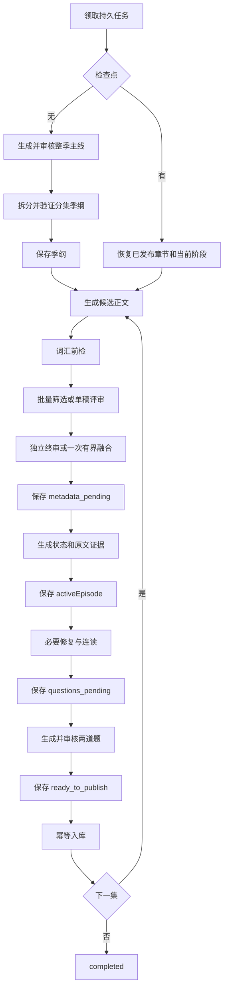

# Read & Remember API

“拾词”移动端和 Web 端共用的 TypeScript REST API。服务基于 Express 5 与 Node 内置 SQLite，默认监听 `0.0.0.0:4000`。

## 目录

- [快速开始](#快速开始)
- [运行与存储](#运行与存储)
- [系统架构](#系统架构)
- [API 与认证](#api-与认证)
- [连续故事生成](#连续故事生成)
- [文章翻译](#文章翻译)
- [文章朗读](#文章朗读)
- [运营、投递与去重](#运营投递与去重)
- [测试与构建](#测试与构建)
- [后续优先级](#后续优先级)

## 快速开始

要求 Node.js 22.5 或更高版本。

```bash
cd server
npm install
npm run setup:ecdict
npm run dev
```

本地入口：

- 用户网站：`http://localhost:4000/`
- 运营后台：`http://localhost:4000/admin/`
- 健康检查：`http://localhost:4000/health`
- API 前缀：`http://localhost:4000/api/v1`

手机访问开发机时，应使用电脑的局域网地址，不能使用手机自身的 `localhost`：

```text
http://192.168.1.14:4000/api/v1
```

## 运行与存储

### 网站与容器

服务端可以直接托管 Expo Web 构建产物：

```bash
npm run build:site
npm start
```

网站目录默认是 `../client/dist`，可通过 `WEB_ROOT` 覆盖。仓库根目录的 `Dockerfile` 会一次构建网站与 API；部署时应将容器 `/app/data` 挂载为持久卷。

### 主要配置

本地运行自动读取 `server/.env`。该文件以及本地模型配置均被 Git 忽略。

| 配置 | 默认值或用途 |
| --- | --- |
| `DATABASE_PATH` | 主业务库，默认 `data/read-remember.sqlite` |
| `ECDICT_PATH` | 只读 ECDICT SQLite，默认 `data/ecdict.sqlite` |
| `WEB_ROOT` | Web 静态文件目录，默认 `../client/dist` |
| `ADMIN_API_KEY` | 运营后台密钥；生产环境必须修改 |
| `CUSTOM_STORY_CONFIG_PATH` | 定制故事模型配置路径 |
| `DAILY_PUSH_ENABLED` | 每日自动推荐开关 |
| `DAILY_PUSH_HOUR` | 每日推荐小时 |
| `DAILY_PUSH_TIME_ZONE` | 推荐时区，默认 `Asia/Shanghai` |
| `SYNC_ALLOWED_HOSTS` | 允许导入授权 JSON Feed 的 HTTPS 域名列表 |

首次初始化 ECDICT 会下载约 217 MB 的压缩包：

```bash
npm run setup:ecdict
```

`GET /health` 的 `dictionary` 字段为 `ecdict-ready` 时表示词典可用。中文释义、英文释义、音标和词性从本地 ECDICT 查询；没有真人录音时发音接口返回 `fallback: "device-tts"`。

## 系统架构

| 模块 | 入口 | 职责 |
| --- | --- | --- |
| HTTP API | `src/index.ts` | Express 路由、静态网站、认证与服务装配 |
| 数据库 | `src/database.ts` | SQLite 建表、迁移与连接 |
| 定制故事任务 | `src/custom-story.ts` | 持久任务、进度、日志、自动重试和启动恢复 |
| 故事生成 CLI | `scripts/generate-story-series.ts` | CLI 与兼容导出入口 |
| 故事编排 | `scripts/story-generation/pipeline.ts` | 策划、候选、评审、修稿、检查点和发布 |
| 模型调用 | `scripts/story-generation/model-client.ts` | HTTP/SSE、超时、JSON Schema、响应恢复与错误分类 |
| 连载事实 | `scripts/story-generation/serial-narrative.ts` | 已发布正文指纹、交接事实、线索排期和连读审查 |
| 修复路由 | `scripts/story-generation/repair-routing.ts` | 结构化故障域和局部修复额度 |
| 原文证据 | `scripts/story-generation/evidence-selection.ts` | 本地抽取、裁剪、编号和回填原文引用 |
| 阅读难度 | `scripts/story-generation/reading-difficulty.ts` | Reader Stage 的词汇、句长和信息容量 |

主库包含用户、文章、答题、阅读状态、生词、推荐、故事任务、译文与音频缓存。故事生成日志写入 `custom_story_logs`，策划失败历史写入 `custom_story_planning_history`。

## API 与认证

首次启动由客户端生成并持久化设备 ID：

```bash
curl -X POST http://localhost:4000/api/v1/auth/anonymous \
  -H 'Content-Type: application/json' \
  -d '{"deviceId":"my-phone-2026"}'
```

后续请求使用响应中的 Token：

```text
Authorization: Bearer <token>
```

### 用户 API

| 方法 | 路径 | 说明 |
| --- | --- | --- |
| `GET` | `/health` | 健康检查 |
| `GET` | `/api/v1/exams` | 考试类型 |
| `GET` | `/api/v1/interests` | 兴趣栏目 |
| `POST` | `/api/v1/auth/anonymous` | 匿名设备登录 |
| `GET` | `/api/v1/users/me` | 当前用户 |
| `PATCH` | `/api/v1/users/me/exam` | 切换考试目标 |
| `GET/PATCH` | `/api/v1/users/me/preferences` | 获取或修改阅读偏好 |
| `GET` | `/api/v1/users/me/stats` | 学习统计 |
| `GET` | `/api/v1/daily?date=YYYY-MM-DD` | 当日三篇候选 |
| `GET` | `/api/v1/interest-feed` | 兴趣书架 |
| `GET` | `/api/v1/articles/:id` | 文章与不含答案的题目 |
| `GET/POST` | `/api/v1/articles/:id/translation` | 查询或生成译文 |
| `GET/POST` | `/api/v1/articles/:id/audio` | 查询或生成整篇朗读 |
| `GET/PUT` | `/api/v1/articles/:id/answers` | 恢复或保存答题状态 |
| `GET/PUT` | `/api/v1/articles/:id/reading-state` | 恢复或同步阅读位置 |
| `POST` | `/api/v1/articles/:id/complete` | 提交答案并获取解析 |
| `GET` | `/api/v1/history` | 阅读历史 |
| `GET` | `/api/v1/mistakes` | 错题本 |
| `GET` | `/api/v1/vocabulary` | 查询生词 |
| `PUT/DELETE` | `/api/v1/vocabulary/:word` | 添加、更新或移除生词 |
| `GET` | `/api/v1/pushes` | 自动推荐与运营推送 |

### 定制故事 API

| 方法 | 路径 | 说明 |
| --- | --- | --- |
| `POST` | `/api/v1/custom-stories` | 创建后台故事任务 |
| `GET` | `/api/v1/custom-stories` | 查询书架和任务状态 |
| `GET` | `/api/v1/custom-stories/:id` | 查询单个任务和章节 |

故事完成后只自动解锁第一章；提交本章答案后再解锁下一章。

## 连续故事生成

### 当前流程



一集进入发布必须同时满足：

- 正文段数、总词数、句长、纯英文和非碎片化门禁。
- 剧情、儿童吸引力、分级语言、连续性四项均不低于 7，均分不低于 7.5。
- 后续集相对第一集的单维降幅不超过 1，均分降幅不超过 0.5。
- 高频词覆盖率目标为 95%，发布底线为 `min(目标, 90%)`，允许最多一个词的词典或舍入误差。
- 目标词、地道表达、线索、因果和题目证据都能定位到最终正文。
- 发布前连读没有遗漏核心承诺、凭空规则、缺失因果、未经验证的终局或感官不足。

### 模型输出边界

结构化调用会将当前 Zod 业务 Schema 转成 `response_format.type=json_schema` 随请求发送，并在本地再次解析和校验。带 transform 的 Schema 向模型发送输入态约束；若供应商明确拒绝 JSON Schema，该次请求兼容降级为 `json_object`，本地 Zod 校验仍然生效。

连续性季纲修正只允许模型返回：

```json
{
  "episode": {
    "openingHook": "...",
    "goal": "...",
    "obstacle": "...",
    "choice": "...",
    "consequence": "...",
    "newQuestion": "...",
    "problem": "...",
    "clue": "...",
    "teamworkTurn": "...",
    "emotionalBeat": "...",
    "cliffhanger": "..."
  },
  "clueLedger": [
    { "id": "C1", "clue": "...", "misdirection": "...", "payoff": "..." }
  ]
}
```

程序以旧季纲为基底合并补丁，始终保留：

- 集号、标题、`episodeMission`、`newInformation`、`irreversibleChange`。
- `mustNotRepeat` 和由已发布正文生成的 `entryBridge`。
- 线索 `introducedIn`、`usedIn`、`payoffIn` 的章节安排。

解析失败、Schema 结构失败、业务约束失败、网络错误和内容截断分别记录，不再统一显示为“结构不完整”。

### 连载事实与评审

- `entryBridge` 的已发生事实只来自已发布正文；下一集目标明确标记为尚未发生。
- 已发布正文的指纹不变时复用交接；正文或合同版本变化时才重建未发布章节。
- 连续性评审必须引用前文或当前正文的逐字证据；无效引用由程序删除，相关建议不能进入下一轮。
- 评审合同只描述叙事功能，不规定具体人物路线、道具、对白或动作顺序。
- 向新角色首次展示读者已知的证据属于新后果，不自动判成重复发现。

### 候选、词汇与修稿

- 每次队列尝试只生成一批候选并执行至多一次融合；运行策略初始最多 3 稿，有精英底稿时最多补 2 稿。
- 0 份新稿跳过批评审，1 份新稿走单稿独立评审；日志分别记录生成、前检保留、评分和精英数量。
- 词汇覆盖率达到 85% 的近线稿可以参与剧情评审，但最终发布仍必须达到词汇底线。
- 整批词汇不过线时，只对覆盖率最高的一稿执行一次前置换词。
- 可选优化只有在新稿仍过线且分数提高时采用；异常或退化时保留原合格稿。
- 必要语义修稿使用 best-so-far 策略，不让退化稿覆盖检查点。
- `targetWords` 由程序从最终正文选取，模型不能生成或修改。

### 输出预算与重试

正文 Token 预算使用：

```text
min(16384, max(8192, ceil(maximumWords × 4) + 2048))
```

当前支持的正文上限最高为 800 词，因此所有现有 Reader Stage 实际使用 8192 Token。这个预算用于容纳 JSON 与可能被中转层计入的隐藏推理；文章篇幅仍由正文词数门禁控制。

模型调用层的网络重试、结构重试和内容校正彼此独立。任务层每集最多执行初次尝试加 3 次自动质量续跑；429、529、连接重置和超时等基础设施故障不消耗稿件质量额度。

### 检查点与恢复

| 阶段 | 已持久化内容 | 恢复行为 |
| --- | --- | --- |
| 季纲 | 完整 plan、合同版本 | 不重新生成已通过季纲 |
| `metadata_pending` | 正文、评审、`textHash` | 跳过候选，只补元数据 |
| `activeEpisode` | 正文、元数据、评分、修复计数 | 从必要修复或连读继续 |
| `questions_pending` | 已定稿正文和质量结果 | 只重新命题与验题 |
| `ready_to_publish` | 已通过全部门禁的完整章节 | 只执行幂等发布 |
| 已完成章节 | 文章、质量和顺序 | 恢复时确保文章行存在，不重复回调 |

恢复时会核对正文 `textHash`。元数据与词汇各有一次独立局部修复额度，并在网络调用前持久化；两者不会增加 `fullRewriteCount`。旧检查点保留已经消耗的完整重写次数，已标记 `lexicalRepairExhausted` 的稿件不会重新获得换词额度。

### P0 可靠性验收

| 项目 | 状态 | 自动化证据 |
| --- | --- | --- |
| P0-1 分阶段持久化 | 已完成 | 从 `metadata_pending`、`questions_pending`、`ready_to_publish` 恢复；注入中断后不重跑候选或正文 |
| P0-2 结构化故障路由 | 已完成 | 混合词汇/元数据缺陷先换词再重建证据；局部额度跨重启保持 |
| P0-3 空候选与单候选 | 已完成 | 0 稿短路、1 稿独立评审、候选计数测试 |
| P0-4 原文证据与语义分离 | 已完成 | 本地候选编号/长度校验；非关键词感官表达不误杀；颜色词反例可被 `insufficient_sensory` 阻断 |
| P0-5 可选优化降级 | 已完成 | 注入优化请求失败后保留原稿，并继续连读、命题和幂等入库 |

这些检查证明恢复边界和确定性规则，不保证模型每次都作出正确语义判断。真实模型发布质量仍应使用固定样本和人工盲评持续监测。

### CLI 使用

复制配置后生成连续故事：

```bash
cp config/story-generation.example.json config/story-generation.json
npm run generate:story-series -- --config config/story-generation.json
```

常见模式：

```bash
# 公版名著独立分级重述
npm run generate:story-series -- \
  --source-mode classic --classic treasure-island \
  --interest tiger --exam middle --reader-stage stage1 --episodes 6

# 根据偏好重新创作人物、世界和情节
npm run generate:story-series -- \
  --source-mode favorite --source-title "魔法校园故事" \
  --source-notes "幽默宠物、伙伴闯关、藏在学校里的谜题" \
  --interest cultivation --exam middle --reader-stage stage1 --episodes 6

# 只查看策划提示
npm run generate:story-series -- --interest tiger --exam middle --episodes 6 --dry-run
```

选材模式：

- `original`：完全原创。
- `classic`：基于内置公版作品独立简化重述，不复制商业简写本。
- `favorite`：提取用户偏好的吸引力特征，重新创作具体内容。

可通过 `--reader-stage` 选择 `starter` 至 `stage6`；`auto` 按考试阶段匹配。完整参数运行：

```bash
npm run generate:story-series -- --help
```

## 文章翻译

文章译文支持按需生成和批量预生成。翻译段缓存在 `translation_segments`，完整译文缓存在 `article_translations`。

```bash
cp config/translation.example.json config/translation.json
npm run translate:articles -- --config config/translation.json --dry-run
npm run translate:articles -- --config config/translation.json --limit 10
npm run translate:articles -- --config config/translation.json
```

常用筛选：

```bash
npm run translate:articles -- \
  --config config/translation.json --exam middle --kind interest

npm run translate:articles -- \
  --config config/translation.json --exam middle --force

npm run translate:articles -- \
  --config config/translation.json --limit 10 --force --no-review
```

`reviewEnabled` 默认开启；`reviewModel` 留空时复用翻译模型。`glossary` 固定术语译法。保护标记、题库标签、填空、网址、邮箱和数字如果被模型修改，该文章会失败并重试。

## 文章朗读

文章页可通过 OpenAI TTS 兼容的 Kokoro 服务生成整篇英文朗读。缓存索引位于 `article_audio_cache`，文件默认写入 `data/article-audio/`。

CPU 开发环境示例：

```bash
docker run --name read-remember-kokoro -p 8880:8880 \
  ghcr.io/remsky/kokoro-fastapi-cpu:latest
```

服务配置示例：

```text
KOKORO_BASE_URL=http://127.0.0.1:8880/v1
KOKORO_API_PATH=/audio/speech
KOKORO_MODEL=kokoro
KOKORO_FORMAT=mp3
KOKORO_AUDIO_ROOT=./data/article-audio
KOKORO_DEFAULT_VOICE=af_heart
KOKORO_VOICES=af_heart|温和女声 · 美音,am_michael|沉稳男声 · 美音,bf_emma|自然女声 · 英音,bm_george|沉稳男声 · 英音
```

Kokoro 与本服务位于不同容器时，`KOKORO_BASE_URL` 必须使用容器间可访问的地址。

批量预生成：

```bash
npm run generate:article-audio -- --dry-run
npm run generate:article-audio
npm run generate:article-audio -- --limit 10
npm run generate:article-audio -- --exam middle --kind interest
npm run generate:article-audio -- --voice bf_emma
npm run generate:article-audio -- --voices all
```

同一“文章 + 音色”直接复用缓存；客户端语速变化不会生成多份文件。第一次按 `Ctrl+C` 会在当前文章完成后安全停止。

## 运营、投递与去重

运营后台使用 `X-Admin-Key` 认证，支持题库检索、授权 JSON 导入、白名单 Feed 同步、栏目维护、手动推送和用户统计。本地默认密钥为 `dev-admin-change-me`，生产环境必须通过 `ADMIN_API_KEY` 修改并只在 HTTPS 下使用。

在线同步仅接受 `SYNC_ALLOWED_HOSTS` 中的 HTTPS JSON Feed，并要求填写授权说明。服务不会抓取任意网页或绕过内容授权。

文章导入前会对标准化标题、正文、题干和选项计算 SHA-256 指纹。同一考试阶段中，相同内容只保留一份。数据库约束还保证：

- `deliveries(user_id, delivery_date, slot)`：同一天同一槽位稳定。
- `deliveries(user_id, article_id)`：同一文章不重复推送给同一用户。
- `interest_deliveries(user_id, article_id)`：兴趣书架不重复。
- `daily_auto_pushes(user_id, delivery_date)`：重复调度不重复发送。

每日三选一优先包含连续故事、当前考试真题和兴趣拓展；候选不足时才跨类型补位。未读题库不足时返回现有内容并设置 `corpusExhausted: true`。

## 测试与构建

```bash
npm run typecheck
npm test
npm run build
npm start
```

测试覆盖 API、数据库、证据抽取、修复路由、连载事实、模型响应、故事门禁和分阶段恢复。测试数据库使用临时目录，不会写入本地业务库。

上线前还应固定一组原创、名著重述、不同 Reader Stage、两集与多集样本，记录完成率、人工盲评分、P50/P95 时长、Token 消耗、恢复重复调用数和压缩前后质量差异。

## 后续优先级

P0 已完成。下一阶段按以下顺序推进：

1. **P1-1 统一调用预算**：HTTP、结构、内容与任务级重试从同一持久 ledger 扣减，429/529 使用可恢复冷却时间。
2. **P1-2 缓存确定结果**：按正文、合同、模型、评审版本和上下文哈希缓存，正文或规则变化时失效。
3. **P1-4 单一版本化写作合同**：让生成、压缩、评审和修稿消费同一必要事实与硬任务集合。
4. **P2 可观测性和拆分**：记录阶段、耗时、usage、错误码与采用结果，再按阶段拆分大型编排文件。
5. **P2 持久 Worker**：多实例前补租约、心跳、并发限额和发布事务。

不要同时调整模型、温度、词数、评分线和候选数量，否则无法判断改动效果。

相关资料：

- [根 README 故事流程](../README.md#故事生成阶段)
- [历史故障与质量复盘](./STORY_GENERATION_DIAGNOSIS.md)
